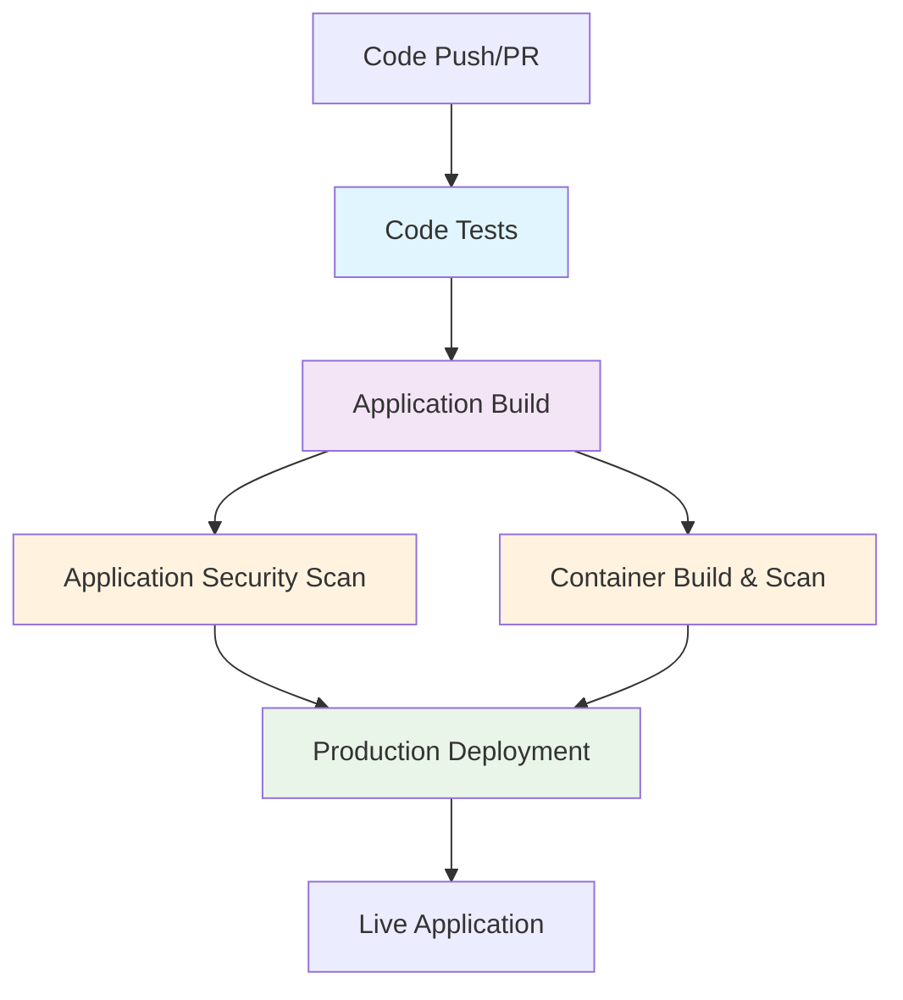

# CI/CD Pipeline Documentation 🚀

This document describes the complete Continuous Integration and Continuous Deployment (CI/CD) pipeline for the Contest Draw Platform.

## 📋 Overview

Our CI/CD pipeline is implemented using GitHub Actions and follows a **security-first approach** with proper dependency management. The pipeline ensures code quality, comprehensive security scanning, and reliable deployments.

## 🔄 Pipeline Architecture



## 🎯 Pipeline Phases

### Phase 1: Code Testing & Quality Checks
**Job Name:** `code-tests`

**Purpose:** Ensures code quality and functionality through comprehensive testing.

**Steps:**
1. **Checkout Code** - Retrieves the latest code from the repository
2. **Setup Bun Runtime** - Installs the Bun JavaScript runtime
3. **Install Dependencies** - Installs all project dependencies
4. **Run Unit Tests with Coverage** - Executes the full test suite with coverage analysis
5. **Upload Test Coverage to Codecov** - Sends coverage data to Codecov for analysis

**Triggers:** Every push and pull request
**Dependencies:** None (entry point)
**Outputs:** `tests-passed` (boolean)

### Phase 2: Application Build & Packaging
**Job Name:** `application-build`

**Purpose:** Builds the production-ready application bundle.

**Steps:**
1. **Checkout Code** - Retrieves the latest code
2. **Setup Bun Runtime** - Installs Bun for building
3. **Install Dependencies** - Installs all dependencies
4. **Build Production Application** - Creates optimized production build
5. **Upload Build Artifacts** - Stores build artifacts for deployment

**Triggers:** Every push and pull request
**Dependencies:** `code-tests` (only runs if tests pass)
**Artifacts:** `production-build` (dist/ directory)

### Phase 3: Application Security Scan
**Job Name:** `application-security-scan`

**Purpose:** Scans the built application and dependencies for security vulnerabilities.

**Steps:**
1. **Checkout Code** - Retrieves the latest code
2. **Setup Bun Runtime** - Installs Bun for building
3. **Install Dependencies** - Installs all dependencies
4. **Build Application for Security Scan** - Creates build for scanning
5. **Run Trivy Filesystem Vulnerability Scan** - Performs comprehensive security scanning
6. **Upload Security Scan Results to GitHub** - Integrates results with GitHub Security tab
7. **Display Vulnerability Report** - Shows detailed vulnerability information

**Triggers:** Every push, pull request, and weekly (Monday 2 AM UTC)
**Dependencies:** `application-build` (scans actual built artifacts)
**Permissions:** `contents: read`, `security-events: write`
**Security Gates:** Fails on critical/high vulnerabilities with fixes available

### Phase 4: Container Build & Security Scan
**Job Name:** `container-build-and-scan`

**Purpose:** Creates a Docker container image and scans it for vulnerabilities.

**Steps:**
1. **Checkout Code** - Retrieves the latest code
2. **Set up Docker Buildx** - Configures Docker for builds
3. **Build Production Container Image** - Creates Docker image using standard docker build
4. **Verify Container Image Build** - Confirms successful image creation
5. **Run Trivy Container Vulnerability Scan** - Scans Docker image for vulnerabilities
6. **Upload Container Security Scan Results to GitHub** - Integrates results with GitHub Security tab
7. **Display Container Vulnerability Report** - Shows detailed container vulnerability information

**Triggers:** Every push and pull request
**Dependencies:** `application-build` (builds after app is ready)
**Permissions:** `contents: read`, `security-events: write`
**Image Tag:** `contest-draw:latest`
**Security Gates:** Fails on critical/high vulnerabilities with fixes available

### Phase 5: Production Deployment
**Job Name:** `production-deployment`

**Purpose:** Deploys the application artifacts for production use.

**Steps:**
1. **Checkout Code** - Retrieves the latest code
2. **Setup Bun Runtime for Deployment** - Prepares Bun for deployment build
3. **Install Dependencies** - Installs dependencies
4. **Build Application for Production** - Creates deployment-ready build
5. **Upload Production Build Artifacts** - Prepares artifacts for deployment

**Triggers:** Only on `main` branch pushes
**Dependencies:** `code-tests`, `application-build`, `application-security-scan`, `container-build-and-scan`
**Artifacts:** `production-deployment` (dist/ directory)

## 🔧 Configuration Details

### Environment Variables
```yaml
REGISTRY: ghcr.io
IMAGE_NAME: ${{ github.repository }}
```

### Workflow Triggers
- **Push to main:** Full pipeline including deployment
- **Pull Request:** All phases except deployment
- **Weekly Schedule:** Security assessment (Monday 2 AM UTC)

### Security Configuration
- **Trivy Settings:** `exit-code: '1'`, `severity: 'CRITICAL,HIGH'`, `ignore-unfixed: true`
- **Security Gates:** Pipeline fails on critical/high vulnerabilities with available fixes
- **Scan Coverage:** Both application filesystem and Docker container images

## 📊 Pipeline Status Indicators

| Phase | Status | Meaning |
|-------|--------|---------|
| 🟢 Code Tests | Passed | All tests pass, code quality maintained |
| 🔵 Application Build | Building | Creating production bundle |
| 🟡 Application Security | Scanning | Scanning built app for vulnerabilities |
| 🟡 Container Security | Scanning | Scanning Docker image for vulnerabilities |
| 🚀 Production Deployment | Deploying | Publishing artifacts |

## 🚨 Failure Handling

### Test Failures
- **Action:** Pipeline stops, no further phases run
- **Notification:** GitHub status checks show failure
- **Resolution:** Fix failing tests and push again

### Security Vulnerabilities
- **Action:** Pipeline fails on critical/high vulnerabilities with fixes
- **Notification:** Results uploaded to GitHub Security tab
- **Resolution:** Update dependencies or fix vulnerabilities before deployment

### Build Failures
- **Action:** Pipeline stops, deployment is skipped
- **Notification:** Build artifacts not created
- **Resolution:** Fix build issues and push again

## 🔍 Monitoring & Debugging

### GitHub Actions UI
- Navigate to **Actions** tab in the repository
- Click on any workflow run to see detailed logs
- Each phase shows individual step results

### Key Metrics to Monitor
- **Test Coverage:** Maintained above 80%
- **Build Time:** Typically 2-3 minutes per phase
- **Security Scan Results:** Review vulnerability reports
- **Deployment Success Rate:** Should be 100% for main branch

### Common Issues & Solutions

#### Security Scan Failures
- **Cause:** Critical/high vulnerabilities with fixes available
- **Solution:** Update dependencies, review security reports

#### Container Build Issues
- **Cause:** Docker image not available for scanning
- **Solution:** Ensure build and scan run in same job

#### Test Failures
- **Cause:** Code changes breaking existing functionality
- **Solution:** Run tests locally before pushing

## 🛠️ Local Development Integration

### Pre-commit Checks
```bash
# Run tests before pushing
bun run test:coverage

# Check for security vulnerabilities
bun audit

# Build locally to catch issues early
bun run build

# Test Docker build
docker build -t contest-draw:latest .
```

### Testing Workflow Changes
1. Create a test branch
2. Make workflow modifications
3. Push to trigger pipeline
4. Review results in GitHub Actions
5. Merge to main when satisfied

## 📈 Performance Optimization

### Current Optimizations
- **Sequential Security Scans:** Application and container scans run after builds
- **Dependency Caching:** Bun caches dependencies between runs
- **Standard Docker Build:** Reliable image creation for security scanning
- **Conditional Deployment:** Only deploys on main branch

### Security-First Approach
- **Fail Fast:** Security gates prevent deployment of vulnerable code
- **Comprehensive Coverage:** Both app and container vulnerabilities scanned
- **Industry Standards:** Only fails on fixable critical/high vulnerabilities

## 🔐 Security Considerations

### Security Gates
- **Application Security:** Scans built application and dependencies
- **Container Security:** Scans Docker image for base image vulnerabilities
- **Failure Policy:** Pipeline fails on critical/high vulnerabilities with fixes
- **Reporting:** All vulnerabilities logged to GitHub Security tab

### Access Control
- Workflow runs with minimal required permissions
- Security scanning has read access to code
- Security events have write access for reporting

### Vulnerability Handling
- **Critical/High with fixes:** Pipeline fails, must be resolved
- **Critical/High without fixes:** Pipeline continues, logged for review
- **Medium/Low:** Logged but doesn't block deployment

## 📚 Additional Resources

- [GitHub Actions Documentation](https://docs.github.com/en/actions)
- [Trivy Security Scanner](https://trivy.dev/)
- [Bun Runtime Documentation](https://bun.sh/docs)
- [Docker Documentation](https://docs.docker.com/)

## 🤝 Contributing to CI/CD

### Modifying the Pipeline
1. Edit `.github/workflows/main.yml`
2. Test changes on a feature branch
3. Review workflow runs in GitHub Actions
4. Submit pull request with changes

### Adding New Phases
1. Define new job with descriptive name
2. Set appropriate dependencies using `needs:`
3. Add clear step descriptions
4. Update this documentation

### Best Practices
- Use descriptive job and step names
- Set appropriate dependencies between jobs
- Include proper error handling
- Document any new phases or changes
- Test thoroughly before merging
- Maintain security-first approach

---

*Last updated: October 2024*
*Pipeline version: 3.0 - Security-First Architecture*