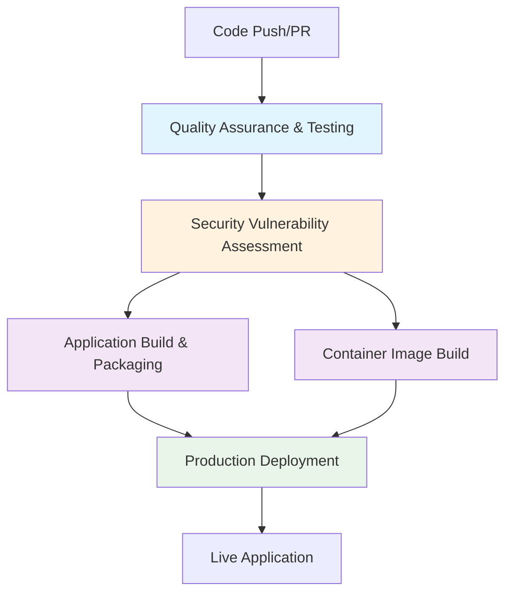

# CI/CD Pipeline Diagram

## Mermaid Diagram Source

## Pipeline Flow Description

1. **Trigger:** Code push or pull request
2. **Quality Assurance:** Tests run first (entry point)
3. **Security Assessment:** Only runs if tests pass
4. **Parallel Builds:** App and container build simultaneously
5. **Deployment:** Only runs on main branch if all previous phases pass

## Phase Dependencies
- Quality Assurance → Security Assessment
- Quality Assurance + Security Assessment → Application Build
- Quality Assurance + Security Assessment → Container Build  
- Application Build + Container Build → Production Deployment

## Timing Estimates
- Quality Assurance: ~2 minutes
- Security Assessment: ~1 minute
- Application Build: ~1 minute
- Container Build: ~2 minutes
- Production Deployment: ~1 minute
- **Total Pipeline:** ~7 minutes
