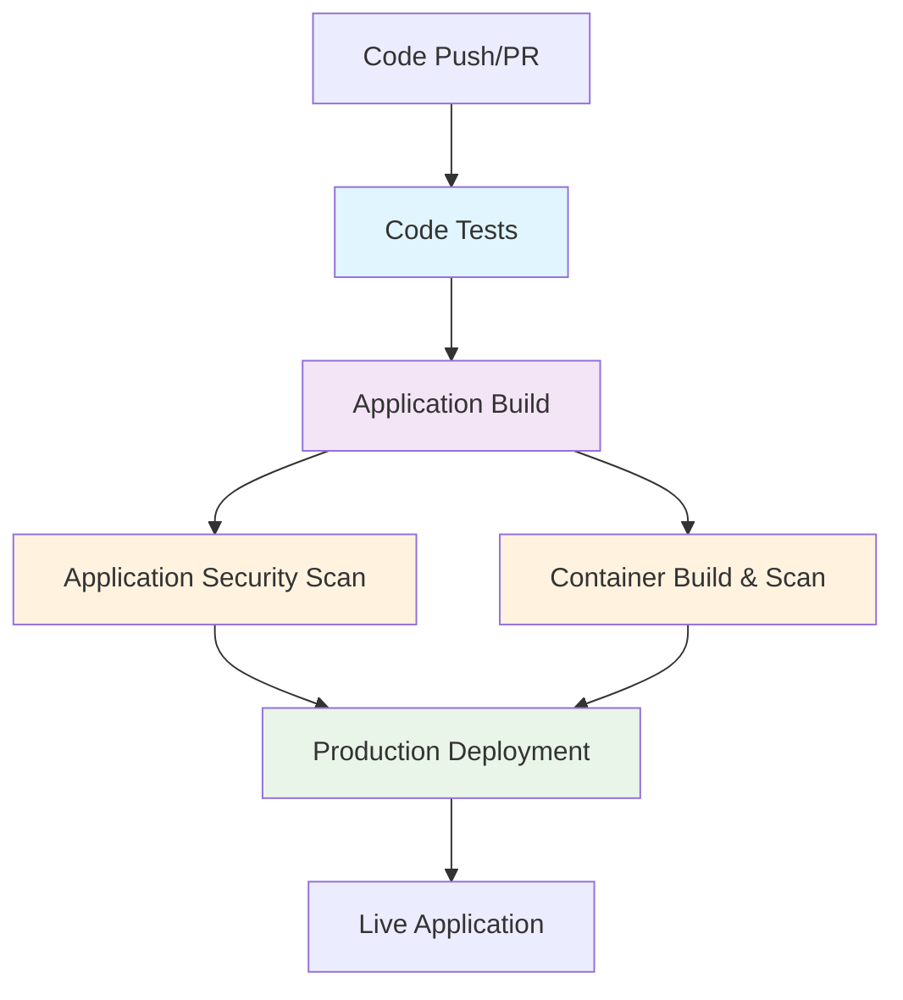

# CI/CD Pipeline Diagram

## Mermaid Diagram Source

## Pipeline Flow Description

1. **Trigger:** Code push or pull request
2. **Code Tests:** Tests run first (entry point)
3. **Application Build:** Builds app after tests pass
4. **Security Scans:** Both app and container scans run after builds
5. **Deployment:** Only runs on main branch if all previous phases pass

## Phase Dependencies
- Code Tests → Application Build
- Application Build → Application Security Scan
- Application Build → Container Build & Scan
- Application Security Scan + Container Build & Scan → Production Deployment

## Security Gates
- **Application Security:** Fails on critical/high vulnerabilities with fixes
- **Container Security:** Fails on critical/high vulnerabilities with fixes
- **Deployment:** Only proceeds if all security scans pass

## Timing Estimates
- Code Tests: ~2 minutes
- Application Build: ~1 minute
- Application Security Scan: ~1 minute
- Container Build & Scan: ~3 minutes
- Production Deployment: ~1 minute
- **Total Pipeline:** ~8 minutes

## Key Improvements
- **Security-First:** Scans run on actual built artifacts
- **Fail Fast:** Security gates prevent vulnerable deployments
- **Comprehensive:** Both app and container vulnerability scanning
- **Industry Standard:** Only fails on fixable critical/high vulnerabilities